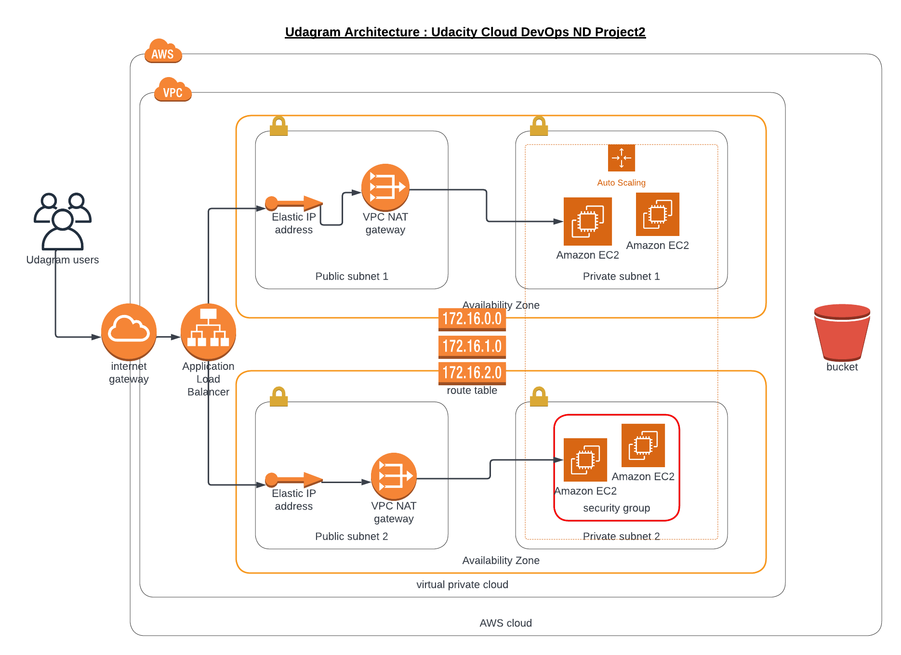

### UdacityProject2
-------------------
udacity cloud devops engineer project 2 -  Deploy a high-availability web app using CloudFormation.

### What is it ?
-------------------
The goal of this project is to provide some cloudformation scripts to deploy a web server for a highly available web app.

### Scenario
-------------------
Your company is creating an Instagram clone called Udagram.

Developers want to deploy a new application to the AWS infrastructure.

You have been tasked with provisioning the required infrastructure and deploying a dummy application, along with the necessary supporting software.

This needs to be automated so that the infrastructure can be discarded as soon as the testing team finishes their tests and gathers their results.

### Optional
-------------------
Add more challenge to the project, once the project is completed, you can try deploying sample website files located in a public S3 Bucket to the Apache Web Server running on an EC2 instance.

### How is the project Structured ?
------------------------------
There are two parts in this project;
  Part1
    - Diagram (Lucid Chart)
  Part2
    - network scripts
    - servers scripts

### What are required to run it ?
-------------------
Amazon aws account and a bucket already deployed having the web app code . Don't forget to adapt the userData to match your webapp sources location

### Architecture



### Running it ?
-------------------
  you can run the part as followed :
  
```
cd udacity_project_2
./create.sh Udagram-Network network.yml network-params.json
```

```
cd udacity_project_2
./create.sh Udagram-Server servers.yml server-params.json 
```

### Try it?
-------------------
Click this link  or
This link:: http://udagr-webap-1c8t95amta2se-894713736.us-east-1.elb.amazonaws.com/
